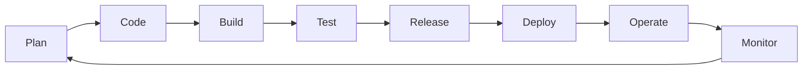
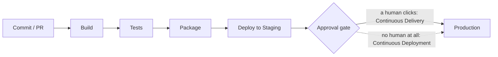
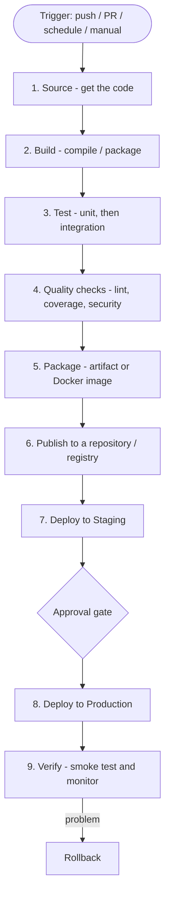
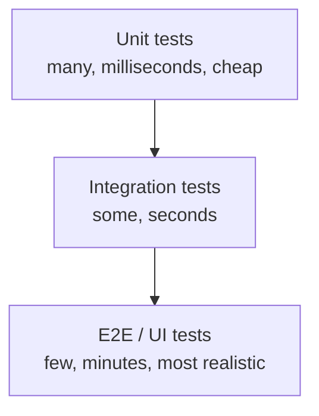
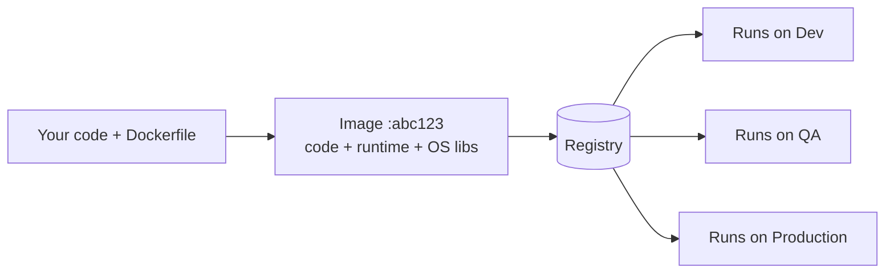
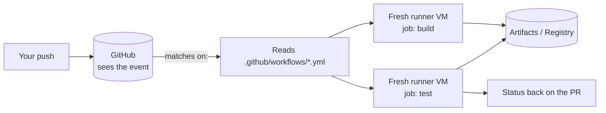
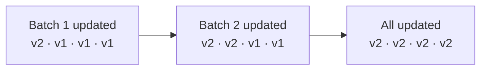
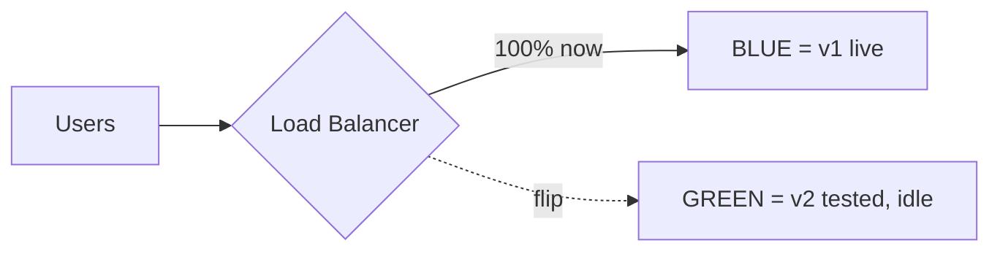
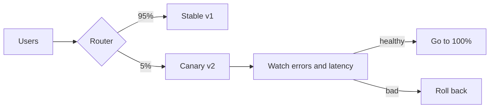

# Unit 2 — CI/CD Pipeline and DevOps Automation
### Value Added Course | 2nd Semester UG | 09:30 – 13:30

> **Teaching approach:** these are 2nd-semester students. They don't need definitions — they need to
> *see a pipeline turn green*, *see it turn red*, and understand why industry pays for this.
> Aim for **35% concept, 65% hands-on**. Every concept is followed immediately by a "do it now" step.

---

## 0. Session Plan

| # | Time | Segment | Mode | Outcome |
|---|---|---|---|---|
| 0 | 09:30 – 09:55 | Unit 1 recap + Git warm-up | Talk + Lab | Everyone has a repo & a merged PR |
| 1 | 09:55 – 10:30 | CI vs CD vs CD + pipeline architecture | Talk + Board | Can draw a pipeline |
| 2 | 10:30 – 11:15 | **LAB 1** — first workflow, break it, fix it | Hands-on | Green build, red build, green again |
| — | 11:15 – 11:30 | Break | | |
| 3 | 11:30 – 12:15 | Build & test automation + **LAB 2** (matrix, badge, branch protection) | Concept + Hands-on | Merge blocked by a failing test |
| 4 | 12:15 – 12:45 | Artifacts & registries + **LAB 3** (artifact, secrets, Docker demo) | Concept + Hands-on | Downloadable artifact |
| 5 | 12:45 – 13:05 | Pipeline triggers + inside GitHub Actions | Concept + Demo | Can chain and read any workflow |
| 6 | 13:05 – 13:25 | Deployment strategies + **LAB 4** (deploy + approval gate) | Concept + Hands-on | A live URL |
| 7 | 13:25 – 13:30 | Wrap-up + homework | Talk | |

**Buffer rule:** if you're behind at 12:15, cut the Docker part of Lab 3 and keep Lab 4.
Students must leave with a **live deployed URL** — that is the emotional payoff of the day.

**If you are behind at 12:45:** cut Segment 5 to a 5-minute screen-share of the reference repo's two
workflows chained together. Never sacrifice Lab 4 for Segment 5.

## 0.1 Before the session

**Hand out in the PREVIOUS class — the single biggest time-saver:**
`Unit2-Before-We-Start.md`, plus a clear instruction to **install everything and create the empty
`cicd-lab` repo at home**. If 40 students generate Personal Access Tokens at 09:35, you lose Lab 1.

**Instructor checklist**
- [ ] Share `labs/lab-starter/` as a ZIP — **minus the `.github` folder**, which is the answer key
- [ ] Dry-run Labs 1–4 on your own account, especially **Pages** and **Environments**
- [ ] Open tabs: **the reference repo** `https://github.com/ravissajjan/demo` (its Actions tab) and the Actions Marketplace
- [ ] Mobile hotspot ready — college Wi-Fi blocking GitHub is the #1 lab killer
- [ ] Print `Unit2-Takeaway-Sheet.md` — hand out at 13:25, not earlier

### 📚 The reference repo — `github.com/ravissajjan/demo`

Use this as your **live demo repo**. It is the "grown-up" version of what students build, and it
covers a few things the teaching lab deliberately leaves out:

| It shows | Our lab | Use it to… |
|---|---|---|
| `npm ci` with a committed `package-lock.json` | zero deps, so no lock file | Show what real reproducible installs look like (Segment 3.1) |
| A Node **matrix** in CI | same — students build it in Lab 2A | Compare their file against a real one |
| **Docker Hub** push with `DOCKERHUB_USERNAME` / `DOCKERHUB_TOKEN` | same — students do it in **Lab 3D** | Demo a **real** secret being created and used (Segment 4.3) |
| `workflow_run` — deploy triggers after CI succeeds | same — `cd.yml` is chained to CI | Show pipeline **chaining** (Segment 5.1) |
| Docker **smoke test** inside CI | same — the `image:` job curls `/health` | Show "verify after build", not just tests (Segment 1.3) |
| Image scanning / CVEs (Docker Scout) | — | Segment 4 security talk |

> Don't ask students to copy it — it's too much for a first session. Project it when someone asks
> *"but what does a real one look like?"*

**Students arrive with:** Git, Node 20+, VS Code, a GitHub account, a saved Personal Access Token,
and an empty Public `cicd-lab` repo. Docker optional.

> Say out loud: **Actions runs on GitHub's servers.** A student with a broken laptop can still finish
> 80% of the labs in the browser — press `.` on any repo.

## 0.2 Story index — use these when energy drops

Every segment has a 💡 box. They exist to reset attention, and each one carries the segment's lesson.
Keep them in your back pocket for the moment eyes glaze over or fast students are waiting on slow ones.

| Where | Story | The point |
|---|---|---|
| Segment 1 | Amazon deploys every 11.6 seconds | No human can test at that speed |
| Segment 2 (during lab) | **Knight Capital — $440M in 45 minutes** | One skipped server. Manual deploys kill companies |
| Segment 3 | **Ariane 5 — $370M in 37 seconds** | Reused code nobody re-tested |
| Segment 3 | **Type `5.e` into our own deployed calculator** | A green pipeline is not a correct program |
| Segment 4 | **npm `left-pad` — 11 lines** | Why companies run their own artifact repo |
| Segment 4 | **SolarWinds** | The pipeline itself is a target |
| Segment 5 | GitHub Actions put CI inside the repo itself | The tool that wins is the one with no setup step |
| Segment 6 | Coal-mine canaries | Why 1% of users go first |
| Segment 6 | Staged app-store rollouts | They've already lived inside a canary |

## 0.3 Engagement toolkit — how to keep 4 hours alive

### 🎭 The Analogy Bank

Every concept below has an everyday equivalent. **Say the analogy first, the technical term second.**
Second-semester students hold on to pictures, not definitions.

| Concept | Say this |
|---|---|
| **Pipeline** | A **restaurant kitchen line** — chop → cook → plate → serve. Each station checks the last one's work |
| **CI** | **Spell-check while you type**, instead of proofreading 300 pages the night before submission |
| **Fail fast** | If the rice is burnt, you **don't continue plating it**. Stop at that station |
| **Runner** | A **hotel room** — you get a clean one, you use it, housekeeping wipes it completely |
| **Build** | Packing a **tiffin box**: the food is ready to carry, not just ingredients on the counter |
| **Artifact** | That **sealed tiffin box with a date label** — you can carry it anywhere and know what's inside |
| **Registry** | The **fridge / store room** where all the labelled tiffins are kept |
| **Build once, deploy many** | You don't **re-cook** the food for each family member. One dish, many plates |
| **Unit test** | Tasting the **dal** by itself. **Integration test**: tasting dal + rice together. **E2E**: the guest eats the full meal |
| **Branch protection** | The **exam invigilator**. You may write anything, but nothing leaves the hall unchecked |
| **Secrets** | Your **ATM PIN**. You use it, you never write it on the card |
| **Matrix build** | Testing your app on **Android 12, 13 and 14 at the same time**, not one after another |
| **Rolling deployment** | Replacing **tube lights one at a time** — the room is never fully dark |
| **Blue-Green** | Two identical **stages at a college fest**. Set up the second one fully, then just move the spotlight |
| **Canary** | The **first spoon tasted** before serving the whole batch to 500 people |
| **Feature flag** | The bulb is **installed and wired**, but the switch is still off |
| **Rollback** | **Ctrl + Z** for production |

### 🙋 The Human Pipeline — 6-minute unplugged activity (do this at 09:57, before any code)

Nothing beats this for making "pipeline" click. No laptops.

1. Call **6 volunteers** to the front. Give each a sign: **Code · Build · Test · Package · Deploy · Monitor**.
2. Give the "Code" student a paper aeroplane or a folded sheet — that's a **commit**.
3. Pass it down the line. Each student inspects it and passes it on. It reaches "Deploy". Applause.
4. **Round 2:** secretly tell "Test" to **reject** it — hold the paper up and shout **"FAILED!"**
5. Ask the line: *"What should the rest of you do now?"*
   The answer they'll reach themselves: **stop — don't package or deploy broken work.**
6. **Round 3:** ask the class *"where would you put a human who says yes/no before Deploy?"*
   Someone will point at the right spot. That's the **approval gate** they'll build in Lab 4.

> Total cost: one sheet of paper. Payoff: they now own the words *stage*, *fail fast* and *gate*
> before they ever see YAML. Refer back to it all day: *"Remember who shouted FAILED?"*

### 🎯 Predict-then-check — use before every single push

Never let them run a command without a prediction. It takes 10 seconds and doubles attention.

- Before the first push: *"Hands up — who thinks this will pass?"* Count the hands out loud.
- Before the deliberate bug: *"Will the pipeline catch this? Green or red? Commit to an answer."*
- Before the matrix run: *"How long will 3 jobs take compared to 1? Double? Triple? Same?"*
- Before branch protection: *"Try to merge it. Go on. What do you think will happen?"*

A wrong prediction is the best possible moment to teach. They remember being surprised.

### 🏆 Gamify the labs (costs nothing, changes the room)

| Game | How |
|---|---|
| **First Green** | Write the first 5 students to get a green tick on the board. It creates urgency without pressure |
| **Bug Bounty** | You commit a broken PR to your demo repo. First student to read the log and name the failing line wins |
| **Fastest Pipeline** | Everyone reports their run time in seconds. Fastest wins. Then ask *"why was yours faster?"* → caching |
| **Explain It Back** | Anyone who finishes early must go help two neighbours. Teaching is the real test of understanding |
| **Predict the Strategy** | In Segment 6, read out a scenario; class votes Blue-Green / Canary / Rolling by show of hands |

### ⚡ 60-second energy resets

Use one whenever the room goes quiet and screens take over.

- *"Turn to your neighbour and explain what a runner is. 30 seconds each."*
- *"Everyone stand up. Sit down when you can name one deployment strategy."*
- *"Show me on your fingers: how many stages are in our pipeline?"*
- Read a 💡 story from the Story Index.

## 0.4 Platform setup — every click, in order

Nothing is *installed* for GitHub Actions — it runs on GitHub's servers. But the session changes
**six repository settings**. Here they are in one place so nothing gets discovered mid-lab.

| # | Setting | Where | When | Why |
|---|---|---|---|---|
| 1 | GitHub account + **Personal Access Token** | github.com → Settings → Developer settings | **Pre-work** | The push password |
| 2 | **Empty Public repo** `cicd-lab` (no README) | github.com → New repository | **Pre-work** | A README makes the first push fail |
| 3 | **Actions** | — | automatic | Enabled by default on new repos |
| 4 | **Secret** `MY_SECRET` | Settings → Secrets and variables → Actions | Lab 3B | Shows log masking (`***`) |
| 5 | **Branch protection** on `main` | Settings → Branches (or Rules → Rulesets) | Lab 2C | Turns CI into a gate |
| 6 | **Pages source = GitHub Actions** | Settings → Pages | Lab 4.1 | Enables deployment |
| 7 | **Environment** `production` + Required reviewers | Settings → Environments | Lab 4.3 | The approval gate |

### 🔴 The repo MUST stay Public — this is not a style preference

On the **GitHub Free** plan, two of the features this session depends on are **public-repo only**:

| Feature | Private repo on Free | Public repo on Free |
|---|---|---|
| **Branch protection** (Lab 2C) | ❌ Not available | ✅ Works |
| **Environments + required reviewers** (Lab 4.3) | ❌ Not available | ✅ Works |
| **Actions minutes** | Limited monthly quota | ✅ Unlimited |
| **GitHub Pages** (Lab 4) | ❌ Needs a paid plan | ✅ Works |

> If a student makes their repo private "to be safe", **Labs 2C and 4 silently stop working** — the
> settings simply aren't in their menu, and they'll think they did something wrong.
> Say this at 09:35 and again before Lab 2: **public repo, no real secrets in it, ever.**

### What is NOT needed today
- ❌ No CI server to install — Actions is hosted.
- ❌ No `npm install` — the sample project has **zero dependencies**.
- ❌ No Docker for students — it's an optional instructor demo.
- ❌ No CI tool to choose — we use GitHub Actions all day, start to finish.

---

# SEGMENT 0 — Recap of Unit 1 (09:30 – 09:55)

## Rapid-fire recall (8 min — ask, don't tell)

1. What problem was DevOps invented to solve?
2. Expand **CALMS**.
3. Difference between `git fetch` and `git pull`?
4. Difference between a **branch** and a **fork**?
5. Why raise a **Pull Request** instead of pushing straight to `main`?
6. Who resolves a merge conflict?

### Redraw this on the board



- **Unit 1** covered `Plan → Code` (culture, Git, branches, PRs).
- **Unit 2 (today)** covers `Build → Test → Release → Deploy` — **the machine that does everything after you press "Merge"**.

### CALMS in industry language
| Letter | Textbook | What it means on a real team |
|---|---|---|
| **C**ulture | Shared responsibility | "It works on my machine" is not an accepted answer |
| **A**utomation | Automate the repetitive | If a human does it twice, script it |
| **L**ean | Small batches | Ship 10 small changes, not 1 giant release |
| **M**easurement | Metrics | Deploy frequency, lead time, change-fail rate, MTTR |
| **S**haring | Break silos | Devs get paged too; Ops write code too |

## Git warm-up (15 min — everyone types)

Run **LAB 0** from the student handout. Everyone must end with a repo `cicd-lab` containing
`main` + one merged Pull Request. This repo is used for the whole day.

> Walk the aisles. The two failures you will see:
> **(a)** authentication — tell them to use a Personal Access Token or `gh auth login`, never a password;
> **(b)** `src refspec main does not match any` — they forgot to commit.

**Industry connect:**
> "In a company, step 5 is not optional politeness. `main` is **protected** — you *cannot* push to it.
> A robot checks your PR before a human does. Building that robot is today's class."

---

# SEGMENT 1 — CI, CD & Pipeline Architecture (09:55 – 10:30)

## 1.1 The problem, as a story (5 min)

> 8 students build one project. Everyone codes for 3 weeks on their own laptop. On the last night you merge.
> Nothing compiles. Two people used different library versions. Someone's code only works because of a
> file on *their* desktop. You spend 6 hours integrating and 0 hours building features.

That is **integration hell**. Industry lived there until about 2005.

**The fix:** don't integrate once at the end. Integrate **many times a day** and let a machine check every single time. That is Continuous Integration.

> 🎭 **Say this first:** CI is **spell-check while you type**.
> The alternative — what you just described — is proofreading 300 pages the night before submission.
> Same words, same effort. Completely different amount of pain.

> 📖 **DEFINITION — Continuous Integration**
> The practice of merging every developer's work into the shared main branch **several times a day**,
> where each merge is automatically **built and tested** by a machine.

---

### 💡 Fact — how often does industry actually deploy?

| Amazon | A 2011 talk reported one deployment **every 11.6 seconds** |
|---|---|
| Etsy | 50+ a day |
| A traditional bank | Once every 2–6 weeks, with an approval committee |
| Your college project | Once, the night before submission 🙂 |

Ask: *"If Amazon deploys every 11 seconds, how many humans test each release?"*
Answer — **zero** — is the entire reason this unit exists.

---

## 1.2 The three CDs — never confuse these



| Term | Meaning | Human involved? |
|---|---|---|
| **Continuous Integration** | Every commit is automatically built and tested | No |
| **Continuous Delivery** | Every passing build is **ready** to release at any moment | **Yes — one button** |
| **Continuous Deployment** | Every passing build **goes to production** automatically | No |

**The 10-second exam answer:**
> Continuous **Delivery** = *always ready* to deploy. Continuous **Deployment** = *actually deploys*, no human click.

> 📖 **DEFINITION — Continuous Delivery**
> Every change that passes the pipeline is automatically packaged and kept in a **releasable state**,
> so the business can ship it at any moment by approving it.

> 📖 **DEFINITION — Continuous Deployment**
> The same as Continuous Delivery, except the final release to production happens **automatically**,
> with no human approval step.

**Reality check:** most Indian service companies and banks do CI + Continuous **Delivery** (approval gates, audits).
Product companies — Amazon, Netflix, Flipkart, Razorpay — do Continuous **Deployment**.

## 1.3 Pipeline architecture (15 min — draw it, don't slide it)

A **pipeline** is an ordered set of **stages**. Each stage has **jobs**, each job has **steps**.
If a stage fails, everything stops — **fail fast**.

> 🎭 **Say this first:** a pipeline is a **restaurant kitchen line** — chop → cook → plate → serve.
> Each station checks the previous station's work. And if the rice is burnt at the cooking station,
> nobody continues plating it. **That is "fail fast".**
>
> If you ran the Human Pipeline activity, point at the six volunteers: *"you were the stages."*



### Vocabulary table — they will use this all day

| Concept | In a GitHub Actions workflow |
|---|---|
| The whole automation | **Workflow** — one file in `.github/workflows/` |
| A phase | a **job** (parallel by default, ordered with `needs:`) |
| One command | a **step** with `run:` |
| A step someone else wrote | an **action** — `uses: actions/checkout@v4` |
| The machine it runs on | a **runner** — `runs-on: ubuntu-latest` |
| What starts it | an **event** — `on:` |
| The output produced | an **artifact** — `actions/upload-artifact` |

### Principles of a good pipeline
1. **Fast** — feedback in under 10 minutes, ideally under 5. Longer and developers stop waiting.
2. **Fail fast, fail cheap** — run lint and unit tests *before* slow tests.
3. **Reproducible** — same commit ⇒ same result, every time.
4. **Build once, deploy many** — build **one** artifact and promote *that same one* Dev → QA → Prod.
5. **Clean environment** — every run starts on a fresh machine.
6. **Everything as code** — the pipeline lives in the repo and is reviewed in PRs.
7. **No secrets in YAML** — use encrypted secrets.

> **Principle #4 is the most common interview question in this unit.**
> If you rebuild for production, you are deploying something **nobody tested**.

## 1.4 Why GitHub Actions (5 min)

| | **The old way** | **GitHub Actions** |
|---|---|---|
| Setup | Install a CI server, keep it patched, back it up | Nothing — it's already in the repo |
| Where the config lives | A separate admin UI | A `.yml` file **next to your code**, reviewed in PRs |
| Who can change it | An ops team | Whoever opens the pull request |
| Cost to start | A server + an admin | Free for public repos |

**The single idea that makes it click:** the pipeline is **just another file in your repo**. It gets
branched, reviewed and rolled back exactly like the application code. That is what "pipeline as code"
means, and it is why the config file lives at `.github/workflows/` and not in a web console.

> Name-drop the family so they recognise it in job descriptions: **GitLab CI, Azure DevOps, CircleCI, AWS CodePipeline, ArgoCD**.
> Say it plainly: *"They all do the same five things. Learn the concepts here and you can read any of them."*

---

## 📌 SEGMENT 1 SUMMARY — put this on the board before the lab

1. **CI** = every commit is automatically built and tested. **CD (Delivery)** = always ready to ship.
   **CD (Deployment)** = ships by itself.
2. A **pipeline** = stages → jobs → steps. If a stage fails, everything stops. **Fail fast.**
3. The pipeline is **code**, lives in the repo, and is reviewed like any other code.
4. **Build once, deploy many** — never rebuild for production.
5. Every CI tool differs in *syntax*, not in *concepts*. Learn the concepts once.

---

# SEGMENT 2 — LAB 1 (10:30 – 11:15)

Run **LAB 1** from the student handout.

> 🎯 **Before they press Enter on the first push:** *"Hands up — who thinks this will go green?"*
> Count the hands out loud and write the number on the board. Then run it.
> Do the same before the deliberate bug: *"Green or red? Commit to an answer."*
> A wrong prediction is the best teaching moment you will get all day.

### What to emphasise while walking around

- **The file path is not optional:** `.github/workflows/name.yml`. 90% of "my workflow doesn't run" is a wrong folder or a Tab character in the YAML.
- **`uses:` vs `run:`** — borrow someone's tested tool, or type a command yourself.
- **`runs-on: ubuntu-latest`** — a brand-new computer in a Microsoft data centre, yours for a few minutes, then deleted forever.
  🎭 *Say it as:* a **hotel room**. You get a clean one, you use it, housekeeping wipes it completely.
  That's why your build can't secretly depend on a file sitting on your desktop.
- **Read the logs.** Make every student expand at least one failing step and point at the line that says which test failed.

### 💡 Story break — for while fast students wait

**Knight Capital, 2012.** A manual deployment missed **1 of 8 servers**. That one stale server traded
wildly: **$440 million gone in 45 minutes**, more than the company was worth. It didn't survive.

Ask: *"Which thing you just built would have prevented this?"*
→ **Automated deployment.** A machine doesn't forget server number 8.

### The "break it" moment (Lab 1.5) — the best 10 minutes of the day

After the red ❌ appears on the PR, stop the class and say:

> "The bug was caught in 40 seconds by a machine — not in 4 weeks by a customer.
> CI is a safety net for the team, not a punishment for the developer."

**Checkpoint:** every student has a green build, has seen a red build, and has fixed it back to green.

---

# ☕ BREAK 11:15 – 11:30

---

# SEGMENT 3 — Build & Test Automation (11:30 – 12:15)

## 3.1 What "build" actually means (7 min)

Build = **turn source code into something a machine can run**, the same way every time.

> 📖 **DEFINITION — Build**
> The automated process of converting source code into a runnable, shippable form — compiling,
> resolving dependencies, and packaging — producing the **same result every time** for the same input.

> 🎭 **Say this first:** building is **packing a tiffin box**.
> Ingredients on the counter are source code. A sealed, labelled tiffin you can carry anywhere
> — that's a build.

| Stack | Build means | Tool |
|---|---|---|
| Java | `.java` → `.class` → `.jar` / `.war` | Maven, Gradle |
| .NET | compile → `.dll` | `dotnet build` |
| Node / JS | install deps, bundle, minify | npm, Vite, webpack |
| Python | resolve deps, build a wheel | pip, poetry |
| C/C++ | compile + link → binary | make, CMake |
| Anything containerised | `docker build` → image | Docker |

> Our lab's "build" is deliberately a tiny `build.js` that copies a file into `dist/`.
> The *concept* — produce a shippable folder — is identical to a 40-minute Java build.

**One real detail worth teaching:** in CI you always use the *deterministic* install command —
`npm ci` (not `npm install`), `mvn -B verify`, pinned `requirements.txt`. It installs the **exact**
locked versions and fails if they don't match. That is reproducibility in one command.

## 3.2 The Test Pyramid (8 min)

> 📖 **DEFINITION — Automated test**
> Code whose only job is to check that *other* code behaves correctly — and to fail loudly when it doesn't.

> 🎭 **Say this first:** a **unit test** is tasting the dal by itself.
> An **integration test** is tasting dal *with* rice. An **E2E test** is the guest eating the whole meal.
> You taste the dal often and cheaply. You can't ask a guest to eat 400 meals a day — which is exactly
> why the pyramid has that shape.

### 💡 Fact — the most expensive missing test in history

**Ariane 5, 1996.** The rocket exploded **37 seconds** after launch. Cause: **reused Ariane 4 code**
that nobody re-tested on the faster rocket. Cost: **~$370 million**, in under a minute.

> Tests don't prove your code works. They prove it **still** works after something changes.
>
> *Side note:* the word "bug" comes from a real **moth** found in the Harvard Mark II in 1947 and
> taped into the logbook by Grace Hopper's team.



| Level | Tests what | Speed | Run when | Tools |
|---|---|---|---|---|
| **Unit** | One function on its own | ms | Every commit | JUnit, Jest, pytest, `node:test` |
| **Integration** | Modules + DB/API together | seconds | Every PR | Supertest, Testcontainers |
| **E2E / UI** | Real browser, real journey | minutes | Nightly / before release | Selenium, Cypress, Playwright |

**Industry rule of thumb:** ~70% unit, ~20% integration, ~10% E2E.
Mostly-E2E ("ice cream cone") = slow, flaky pipelines that everybody learns to ignore.

### 🎯 Live demo — a bug your own green pipeline cannot catch

Do this on the projector right after the pyramid. It takes two minutes and it lands harder than any slide.

1. Open the deployed Pages site. Put `7` in the first box, `+`, and type **`5.e`** in the second.
2. Press Calculate. It answers **7**.

Ask: *"Our pipeline is green. Five tests passed on three Node versions, the container answered its
health check, the site deployed. So why is the answer wrong?"*

Let them struggle, then show the two causes:

- `<input type="number">` returns an **empty string** when the text isn't a valid number, and
  `Number("")` is **`0`** — not `NaN`. So it quietly computed `7 + 0`. Worse than a crash: `NaN`
  would have *looked* broken, `0` looks like an answer.
- Now the real point. Open `math.js` and `index.html` side by side and ask **who imports `math.js`**.
  Answer: only `math.test.js`. The page has its own **inline copy** of the arithmetic.
  **The tested code is never shipped, and the shipped code is never tested.**

> The lesson: a pipeline verifies **what you pointed it at**, and nothing else. Green means
> *"the checks I wrote passed"* — never *"the software is correct."* This is precisely the gap the
> **E2E layer** of the pyramid exists to close, and it is the answer to homework Part 3 question 2.

This is deliberate in the lab code. Leave it broken — it is worth more as a demonstration than as a
working calculator.

**Other quality gates to name-drop:**
- **Lint / static analysis** — ESLint, Checkstyle, Pylint, SonarQube
- **Code coverage** — % of lines the tests actually run. Caveat: *coverage is a smoke detector, not a fireproof house.*
- **Dependency scanning** — Dependabot, `npm audit`, OWASP Dependency-Check. About 80% of your app is other people's code.
- **Secret scanning** — catches an API key committed by mistake.

## 3.3 LAB 2 (30 min)

Run **LAB 2** from the student handout: matrix, badge, branch protection.

### Talking point for the matrix
3 jobs run **in parallel** and finish in the time of one. This is how libraries guarantee
"supported on Java 11, 17 and 21".

### Talking point for branch protection — the most important screen in the unit
> Without branch protection, CI is a **suggestion**. With it, CI is a **contract**.
> Your pipeline now has more authority over `main` than you do — and that is intentional.

> 🎭 **Say this first:** branch protection is the **exam invigilator**.
> You may write whatever you like on your answer sheet — but nothing leaves the hall unchecked.
>
> 🎯 **Predict-then-check:** *"Now try to merge the broken PR. Go on. What will happen?"*
> Let them try and fail. The greyed-out Merge button teaches more than any slide.

### ⚠️ Two things that will eat class time if you don't warn them first

1. **The check is no longer called `test`.** Once the matrix is added, the checks are named
   `test (20)`, `test (22)`, `test (24)`. Students must tick **all three** in the branch-protection
   search box. Also: GitHub only lists checks it has already seen, so the pipeline must have run once.
2. **`git push` to `main` now fails for everyone.** From this point on, Labs 3 and 4 must go through
   branch → PR → merge. Announce it before they hit the error, and frame it as the win it is:
   *"congratulations, you just locked yourself out of production the way a real company does."*

---

## 📌 SEGMENT 3 SUMMARY

1. **Build** = source code → runnable, shippable output, identically every time.
2. CI always uses the **deterministic install** (`npm ci`, `mvn -B`) so builds are reproducible.
3. **Test pyramid:** many fast unit tests, some integration tests, few slow E2E tests (~70/20/10).
4. **Green ≠ correct.** A pipeline only checks what you pointed it at — our own calculator proves it.
4. Quality gates beyond tests: **lint, coverage, dependency scanning, secret scanning**.
5. **Branch protection** is what turns CI from a suggestion into a contract.

---

# SEGMENT 4 — Artifacts & Repositories (12:15 – 12:45)

## 4.1 What is an artifact? (6 min)

An **artifact** is the **finished, versioned output of a build** — the thing you actually ship.

> 📖 **DEFINITION — Artifact**
> The immutable, versioned output produced by a build, stored so it can be traced back to the exact
> commit it came from and deployed unchanged to any environment.

> 📖 **DEFINITION — Artifact repository / registry**
> A dedicated server that stores, versions and secures build artifacts — e.g. Nexus, Artifactory,
> npm, PyPI, Docker Hub, GHCR.

> 🎭 **Say this first:** the **artifact** is the sealed tiffin box with a date label on it.
> The **registry** is the fridge where all the labelled tiffins are kept.
> **"Build once, deploy many"** = you don't re-cook the food for each family member.
> One dish, many plates — and everybody eats the food that was actually tasted.

| Ecosystem | Artifact | Where it is stored |
|---|---|---|
| Java | `.jar`, `.war` | Maven Central, **Nexus**, **Artifactory** |
| Node | `.tgz` | npm registry |
| Python | `.whl` | **PyPI** |
| .NET | `.nupkg` | NuGet |
| Containers | **Docker image** | Docker Hub, **GHCR**, ECR, ACR |

**Why companies run Nexus / Artifactory:**
1. One source of truth for all binaries, versioned and immutable.
2. **Traceability** — version `1.4.2` maps to an exact commit, build number and test report (needed for audits).
3. **Caching proxy** — builds don't break when the internet does.
4. **Security gate** — block known-vulnerable dependencies before developers use them.
5. **Promotion** — the *same* binary moves dev → qa → prod. That is "build once, deploy many".

**Versioning in 60 seconds — SemVer `MAJOR.MINOR.PATCH`:**
MAJOR = breaking change, MINOR = new feature, PATCH = bug fix.
For Docker, **never deploy `:latest`** — tag with the commit SHA. `latest` is not a version, it's a moving target.

### 💡 Fact — 11 lines of code broke the internet

**March 2016.** A developer unpublished his npm packages. One of them, **`left-pad`**, was **11 lines**
that added spaces to a string. Thousands of builds worldwide failed within minutes. npm had to
**un-delete** it.

> Companies running their own caching proxy (Nexus/Artifactory) **didn't even notice**.
> That is exactly what reason #3 above buys you.

### 💡 Fact — the pipeline itself is a target

**SolarWinds, 2020.** Attackers didn't breach 18,000 companies — they breached **one build server**
and injected code during the build. Everyone then downloaded a correctly signed update with a backdoor.

> Hence: pin action versions (`@v4`), least-privilege `permissions:`, short-lived tokens.
> **Your pipeline holds the keys to production.**

## 4.2 Containers as the universal artifact (5 min)



> "It works on my machine" → **ship the machine.**

**Dockerfile** = recipe → **Image** = the artifact → **Container** = a running copy → **Registry** = where images live → **Kubernetes** = runs thousands of them.

> 📖 **DEFINITION — Container image**
> A read-only package containing your application **plus** its runtime, libraries and OS dependencies,
> so it runs identically on every machine.

> 📖 **DEFINITION — Container**
> A running instance of an image — an isolated process with its own filesystem and network view.

### Scanning the image — 3 minutes, high industry value

A container image contains a whole mini operating system, so it inherits **other people's** bugs.

> 📖 **DEFINITION — CVE (Common Vulnerabilities and Exposures)**
> A public, numbered record of a known security flaw in a specific software version — e.g. a package
> inside your image that is known to be exploitable.

Tools like **Docker Scout**, **Trivy** or **Snyk** scan a built image and list the packages and CVEs
inside it. Mature pipelines **fail the build** if a critical CVE is found — that is a quality gate on
the *artifact*, not just on your code.

> 🎭 You tested the dal. Image scanning checks that the **tiffin box itself** isn't cracked.
>
> ⚠️ **Never add a deliberately vulnerable package to a real repo to demo this.** If you want to show
> a finding, use a throwaway lab repo or an old pinned version on a scratch branch. Scan → explain →
> update to the fixed version is the pattern to model.

## 4.3 LAB 3 (19 min)

Run **LAB 3** from the student handout.

### The secrets talk — 4 non-negotiable minutes

> 🎭 **Say this first:** a secret is your **ATM PIN**. You use it every week — and you never,
> ever write it on the card. Putting a password in your code is writing the PIN on the card,
> then leaving the card on a bench in a public park.
- Never put a password, API key or token in code or YAML. Git history is forever, and bots scan public repos **within seconds**.
- Use **Settings → Secrets and variables → Actions**, then `${{ secrets.NAME }}`.
- Secrets are **masked** in logs (`***`) and are not shared with pull requests from forks.
- `GITHUB_TOKEN` is created fresh for each run and expires when the run ends — a perfect example of a **short-lived credential**.
- **Secrets** = encrypted (passwords). **Variables** = plain config (region, app name).

Live demo: `echo ${{ secrets.MY_SECRET }}` and show the log printing `***`.

> **Then make it real \u2014 this is Lab 3D.** The classroom exercise (`MY_SECRET = hello123`) is honest
> but artificial \u2014 nothing actually *uses* it. In Lab 3D students create `DOCKERHUB_USERNAME` and
> `DOCKERHUB_TOKEN` and watch them consumed by a real registry login. Two rules worth stating:
> 1. Use an **access token, never your account password** \u2014 a token can be revoked on its own and is
>    meant for machines.
> 2. The token lives **only** in repo settings. It never appears in any file in the repository.

> **Tag with the commit SHA, not `latest`.** `cd.yml` pushes both, and it's worth 30 seconds:
> `latest` tells you nothing during an incident. The SHA tells you exactly which commit is in
> production \u2014 it's the batch number on a medicine strip.

---

## 📌 SEGMENT 4 SUMMARY

1. An **artifact** is the immutable, versioned output of a build — the thing you actually deploy.
2. Artifacts live in a **registry/repository** (Nexus, Artifactory, npm, PyPI, GHCR).
3. Tag with a **version or commit SHA**. Never deploy `:latest`.
4. A **container image** bundles code + runtime + OS libraries — "ship the machine".
5. **Secrets never go in code.** Use encrypted secrets and short-lived credentials.

---

# SEGMENT 5 — Triggers & Inside GitHub Actions (12:45 – 13:05)

## 5.1 Pipeline triggers (8 min)

| Trigger | Fires when | Used for | Written as |
|---|---|---|---|
| **Push** | Code is pushed | Fast feedback | `on: push` |
| **Pull request** | PR opened/updated | Quality gate before merge | `on: pull_request` |
| **Schedule (cron)** | A fixed time | Nightly regression, security scans | `on: schedule` |
| **Manual** | A human clicks **Run workflow** | Production deploy, rollback | `on: workflow_dispatch` |
| **Tag / release** | `v1.2.0` pushed | Release build | `on: push: tags` |
| **Another workflow** | Upstream workflow finished | Deploy after CI succeeds | `on: workflow_run` |

> **Webhook vs polling — a classic viva question.**
> *Polling*: the CI server asks "any changes?" every few minutes — wasteful and delayed.
> *Webhook*: GitHub **pushes** a message the instant a commit lands — instant and efficient.
> Actions is webhook-driven by design; polling is the fallback when a CI server sits behind a firewall.

> **See chaining working:** `cd.yml` in the lab is triggered by `workflow_run`, so nothing ships
> until CI reports success. That's how repos split one long pipeline into two readable halves —
> **ci.yml proves it works, cd.yml ships it** — and the reference repo does exactly the same.

Two extras every real repo uses:
```yaml
on:
  push:
    paths-ignore: [ '**.md' ]     # don't run the pipeline for doc-only edits

concurrency:                       # cancel a superseded run, saves time and money
  group: ${{ github.workflow }}-${{ github.ref }}
  cancel-in-progress: true
```

## 5.2 Inside GitHub Actions (12 min)

### 💡 Story to open — they're post-lunch sleepy

For fifteen years, "setting up CI" meant *begging the ops team for a server*. In **2019** GitHub asked a
simpler question: the code already lives here, the pull requests already live here — why does the thing
that tests them live somewhere else? Actions moved CI **inside the repo**, and the setup step vanished.

> The tool that wins is rarely the most powerful one. It's the one with nothing to install.

### What actually happens when you push



Four things to say out loud while this is on screen:

1. **The runner is brand new and thrown away.** Nothing from your laptop, nothing from the last run.
   That is what makes builds *reproducible* — and why step one is always `actions/checkout`.
2. **Jobs run in parallel by default.** They only queue up if you write `needs:`.
3. **Each job gets its own machine**, so two jobs cannot share files — that's exactly why artifacts exist.
4. **GitHub hosts the machine for free** on public repos. `runs-on: self-hosted` points at your own
   server instead — the answer to *"what do banks do when the code can't leave the building?"*

### Actions are reusable steps — and a supply chain

`uses: actions/checkout@v4` is somebody else's code running inside your pipeline with access to your
repository. Open the **Marketplace** tab and show one.

| Written as | Means | Safe? |
|---|---|---|
| `@v4` | latest v4.x, gets fixes automatically | fine for official `actions/*` |
| `@main` | whatever is on their branch **right now** | ❌ never — they can change it under you |
| `@a81bbbf…` (full SHA) | one exact frozen commit | ✅ what security-conscious teams pin to |

> Tie it back to **SolarWinds** from Segment 4: a third-party action is a dependency of your *pipeline*,
> and your pipeline holds the production credentials.

Also show **least privilege** — the two lines at the top of the reference repo's workflows:

```yaml
permissions:
  contents: read      # this workflow can read the repo and nothing else
```

### Chaining two workflows — read this together

Open `cd.yml` from the lab folder. This is the payoff of the whole segment:

```yaml
on:
  workflow_run:
    workflows: [ "CI" ]     # wait for the workflow named CI
    types: [ completed ]
  workflow_dispatch:        # ...or let a human start it by hand

jobs:
  gate:
    if: >-
      ${{ github.event_name == 'workflow_dispatch' ||
          (github.event.workflow_run.conclusion == 'success' &&
           github.event.workflow_run.head_branch == 'main') }}
```

Ask the class what that `if:` is protecting against, and wait. There are **two** answers, and they
will usually only find the first:

1. **`completed` is not `success`** — a *failed* CI run also "completes". Without the `conclusion`
   check, broken code ships itself.
2. **CI also runs on pull requests** — without the `head_branch` check, anyone who opens a PR can
   trigger a deployment from unmerged code.

Then point at `outputs.sha`. A `workflow_run` workflow starts on the **default branch**, not on the
commit that triggered it — so `gate` captures the SHA CI actually tested and every later job checks
out *that*. Skip this and you can test one commit and ship another. It is the subtlest bug in the
whole session and worth the two minutes.

**The point to make:** one long pipeline becomes two short readable ones — **CI proves the code is
good, CD ships it** — and the handover between them is a trigger, not a human remembering to click
something. That is exactly the CI/CD split from Segment 1, made out of files.

---

# SEGMENT 6 — Deployment Strategies (13:05 – 13:25)

## 6.1 Why strategy matters (2 min)

> The dangerous moment is not the build. It is the **switch**.
> A deployment strategy answers: how do we replace running v1 with v2 without users noticing,
> and how fast can we undo it?

Two things decide the choice: **downtime** and **blast radius** (how many users a bad release hurts).

> 📖 **DEFINITION — Deployment strategy**
> The method used to replace a running version of an application with a new one, chosen to control
> **downtime**, **risk** and **rollback speed**.

> 📖 **DEFINITION — Blast radius**
> How many users are affected if the new version turns out to be broken.

> 📖 **DEFINITION — Rollback**
> Returning to the previous known-good version after a bad release.

## 6.2 The four strategies

> 🎭 **Give all four as pictures first, then name them.** Ask the class to guess the name each time.
>
> | Picture | Name |
> |---|---|
> | Switch off **every** tube light, fit new ones, switch back on. The room is dark meanwhile | **Recreate** |
> | Replace tube lights **one at a time** — the room is never fully dark | **Rolling** |
> | Two identical **stages at a college fest**. Set the second one up completely, then move the spotlight | **Blue-Green** |
> | **Taste one spoon** before serving the batch to 500 guests | **Canary** |
>
> 🎯 **Predict-then-check game:** read a scenario, class votes by show of hands before you reveal.
> *"Hospital patient-records system at 3 PM?"* → *"Instagram's new filter?"* → *"College Wi-Fi portal at 2 AM?"*

### (a) Recreate / Big-bang — the baseline to criticise
Stop all v1, start all v2.
✅ Simple and cheap. ❌ **Downtime**, and rolling back means another outage.
Used for internal tools and maintenance-window releases.

### (b) Rolling
Replace servers in batches: 4 servers → update 1, health-check, then the next.


✅ Zero downtime, no extra cost.
❌ v1 and v2 run **at the same time** → your API and database must stay backward compatible.
❌ Rollback is slow. **This is the default in Kubernetes.**

### (c) Blue-Green
Two identical production environments. **Blue** is live. Deploy v2 to **Green**, test it fully, then flip the load balancer in one instant.


✅ Near-zero downtime and **instant rollback** — flip back to Blue.
❌ **2× infrastructure cost**. ❌ Databases and in-flight sessions are hard.
Used for banking and payments, where rollback speed matters most.

### (d) Canary
Send a small slice of traffic (1% → 5% → 25% → 100%) to v2 while watching metrics.

> 💡 **Why "canary"?** Coal miners carried caged canaries underground until **1986** — the bird
> reacted to poison gas long before humans could, and died *instead of* the miners.
> A canary deployment is the same trade: **1% of users hit the danger so 99% never do.**


✅ **Smallest blast radius** — a bad release hurts 1% of users, not everyone.
✅ Enables automatic rollback driven by metrics.
❌ Needs strong monitoring, and traffic-splitting infrastructure.
Used by Netflix, Google and every large consumer product.

### (e) Feature flags — bonus, and very current
Deploy the code to everyone but keep the feature **switched off**, then turn it on for selected users.
> **Deployment ≠ Release.** Tools: LaunchDarkly, Unleash, Flagsmith. Also how A/B testing works.

### Comparison table — tell them to copy this

| Criterion | Recreate | Rolling | Blue-Green | Canary |
|---|---|---|---|---|
| Downtime | Yes | No | Near zero | No |
| Extra cost | None | None | **2×** | Small |
| Rollback speed | Slow | Slow | **Instant** | Instant |
| Blast radius if bad | 100% | Growing | 100% after flip | **1–5%** |
| Two versions live together | No | **Yes** | Briefly | **Yes** |
| Monitoring needed | Low | Medium | Medium | **High** |
| Good for | Internal tools | Default K8s apps | Payments, banks | Large consumer apps |

**Also name-drop:** health checks, smoke tests after deploy, rollback vs roll-forward, and the
**DORA metrics** (deployment frequency, lead time, change failure rate, MTTR) — the four numbers
industry uses to measure whether DevOps is actually working.

### 💡 Fact — you've already been in a canary

App stores roll updates out in stages — 1%, then 10%, then everyone — while watching crash reports.
If crashes spike the rollout **halts**, and most users never receive the bad build. Tesla does the
same with car software over the air.

> Ask: *"Has a friend had an app feature before you did?"* Every hand goes up.

## 6.3 LAB 4 (12 min)

Run **LAB 4** from the student handout.

When the `production` job pauses with a *Review deployments* button, say:

> "You just built the difference between Continuous **Delivery** and Continuous **Deployment**.
> It is literally this one checkbox."

Let students open their live URL on their phones. That is the moment they will remember.

---

## 📌 SEGMENT 6 SUMMARY

1. The risky moment is the **switch**, not the build.
2. **Recreate** = downtime, cheap. **Rolling** = free and zero-downtime, but two versions coexist.
3. **Blue-Green** = instant rollback, 2× cost. **Canary** = smallest blast radius, needs monitoring.
4. **Feature flags** separate *deploy* from *release*.
5. Choose using: downtime × cost × rollback speed × blast radius × monitoring maturity.

---

# SEGMENT 7 — Wrap-up (13:25 – 13:30)

## What they built today
- ✅ A pipeline that lints and tests every commit, on 3 Node versions in parallel
- ✅ A red build that **blocked a merge**
- ✅ A downloadable build artifact
- ✅ A live deployment with a **human approval gate**
- ✅ Enough vocabulary to read any CI pipeline on day one of a job

**Hand out `Unit2-Takeaway-Sheet.md` now** — one page with every table, command and exam answer
from today. Give it at the end, not the start, so they build first and revise second.

## One-sentence takeaway
> **CI/CD is not a tool. It is the discipline of making the path from "code on my laptop" to
> "value for a user" automatic, repeatable, fast and reversible.**

## Homework
See `Unit2-Assessment-and-Homework.md`.

## Next session (Unit 3) preview
Containers and orchestration, Infrastructure as Code, configuration management, monitoring and observability, and where DevSecOps fits.

---

# Appendix A — Troubleshooting Cheat Sheet

| Symptom | Cause | Fix |
|---|---|---|
| Workflow doesn't appear in the Actions tab | Wrong path | Must be `.github/workflows/x.yml` |
| `Invalid workflow file ... mapping values are not allowed` | Tabs or bad indentation | Use **2 spaces**, never Tab |
| `remote: Support for password authentication was removed` | Using a password | Use a Personal Access Token or `gh auth login` |
| `src refspec main does not match any` | Nothing committed yet | `git add . && git commit -m "first"` |
| `Updates were rejected ... fetch first` on the very first push | They created the GitHub repo **with** a README | `git pull --rebase origin main` then push again |
| Permission denied pushing a Docker image | Missing permission | Add `permissions: packages: write` |
| Job stuck "Waiting for a runner" | Free minutes used up on a private repo | Make the repo **public** |
| "Branches" or "Environments" settings missing entirely | Private repo on the Free plan | Make the repo **public** — see 0.4 |
| `push declined ... protected branch` | Branch protection is doing its job | Use a branch + PR, not a direct push |
| Required status check not in the dropdown | GitHub only lists checks it has seen | Run the pipeline once, then add the rule |
| Branch protection never blocks anything | The matrix renamed the checks | Select `test (20)`, `test (22)`, `test (24)`, not `test` |
| Tests pass locally, fail in CI | OS difference — **Linux paths are case-sensitive, Windows is not** | Check `Math.js` vs `math.js` |
| Test fails randomly, 1 run in 10 | Flaky test (timing, shared state) | Fix it. Never "re-run until green" — flaky tests destroy trust in CI |
| Pages URL shows 404 | Pages source not set | Settings → Pages → Source: **GitHub Actions** |

# Appendix B — Glossary

| Term | One line |
|---|---|
| Pipeline / Workflow | Automated steps from commit to deployment |
| Runner / Agent | The machine that runs the pipeline |
| Job / Stage / Step | Unit of work / phase / single command |
| Artifact | The finished build output that gets deployed |
| Registry | Storage for container images |
| Trigger | The event that starts a pipeline |
| Quality gate | An automatic pass/fail check |
| CVE | A numbered public record of a known security flaw in a software version |
| Branch protection | Rule that requires checks to pass before merging |
| Secret | An encrypted credential injected at runtime |
| Blast radius | How many users a bad change affects |
| Rollback | Going back to the previous working version |
| Smoke test | A few critical checks run right after deploying |
| Shift-left | Move testing and security earlier |
| GitOps | Git as the single source of truth for deployments |
| DORA metrics | The 4 industry metrics for delivery performance |
| MTTR | Mean Time To Recovery |

# Appendix C — Interview Questions from this Unit

1. Continuous Delivery vs Continuous Deployment?
2. Why "build once, deploy many"?
3. Why does CI use `npm ci` / `mvn -B` instead of the normal install command?
4. Your pipeline takes 45 minutes. How do you get it to 10? *(parallelise, cache, split fast/slow tests, run E2E nightly, fail fast)*
5. How do you handle secrets in a pipeline?
6. Blue-Green vs Canary — when would you pick each, and what does each cost?
7. What happens to the **database** during a Blue-Green deployment? *(the hard one — backward-compatible schema, expand/contract migrations)*
8. A test is flaky. What do you do?
9. Webhook vs polling triggers?
10. What are the DORA metrics, and which would you improve first?

# Appendix D — Further Learning

- **Reference repo (a complete worked example)** — `https://github.com/ravissajjan/demo`
- GitHub Actions docs — `https://docs.github.com/actions`
- Actions Marketplace — `https://github.com/marketplace?type=actions`
- Workflow syntax reference — `https://docs.github.com/actions/reference/workflow-syntax-for-github-actions`
- Free practice — `https://skills.github.com`
- Book: *Continuous Delivery* — Jez Humble & David Farley
- Book: *The Phoenix Project* — Gene Kim
- `https://dora.dev`
